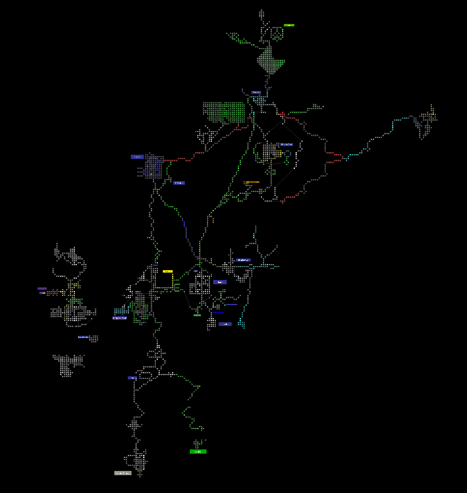

# mudlet-finalrealms
Mudlet module for the Final Realms mud.

Some features are
* Auto mapper with an included map.json containing some areas (surface)
* Basic auto casting offensive spells/refreshing buffs for some situations for some guilds, easy to add new guilds
* Visual bars for hp/gp/xp, current profile and multis
* Stats for damage/xp
* Auto xp bot, ok ok

## Installation

In Mudlet go to Toolbox > Module Manager. Click "Install" and browse to the FinalReals.xml file.
To load up the map (overwriting any previous profile map) do click "Load map" in the toolbar.

## The map

Main surface area zoomed out.

After installing the module press the "Load map" button in the FR toolbar provided by the module, this loads the map.json from the module. Beware that it overwrites the profiles map. Anytime the map has changed the "Load map" needs to be pressed again. To change the map of the module use the "Save map" button, this is to allow several profiles to share the same installed module without them overwriting the map for each other.

Moving about in areas that have a map should hopefully auto detect the room (either via room name + exits or via gmcp.Room.Info.num, not all rooms in the map know its gmcp number).

## map area X
Start creating new rooms in area X. To start adding rooms to main, start by making sure the mapper knows where you are by moving about and verifiyng the position on the map. Then start by using the alias ``map area Main`` for example.

## map auto
To pause mapping do ``map auto`` and it will toggle auto mapping, repeat it to start mapping again.

## map search x
Provide a search string to see rooms where the name contains x

## speed x
Speed walk to the room (x should be a mudlet room id not the gmcp number)
